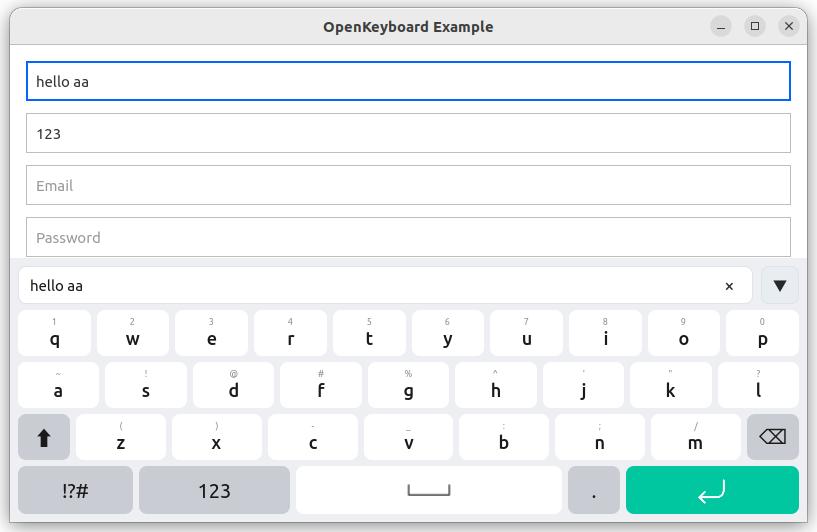
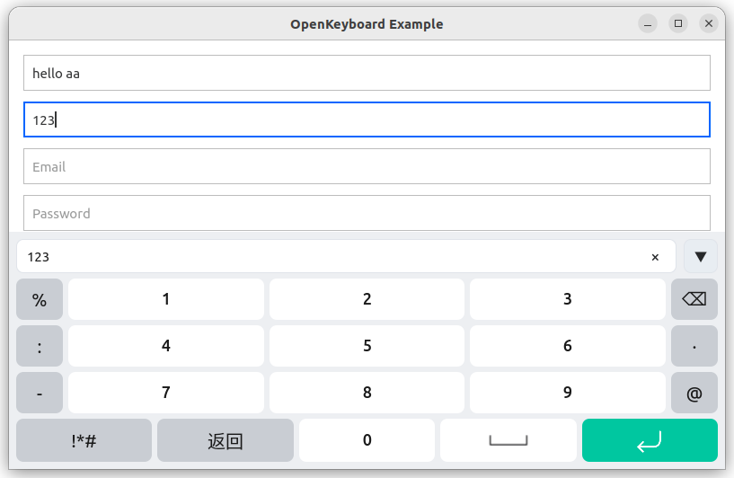
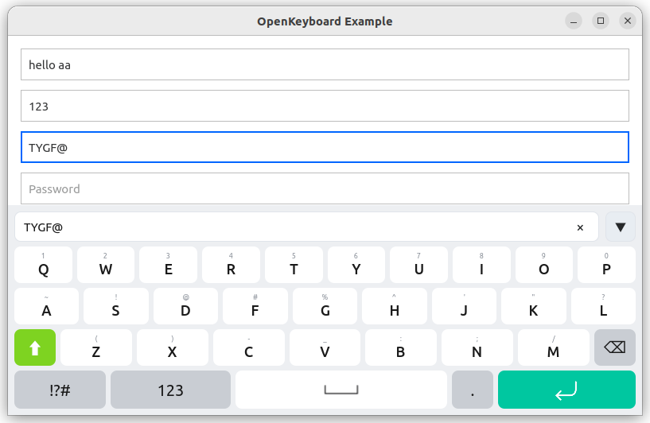

# XizzVirtualKeyboard

> QML 虚拟键盘 · 开箱即用 · **2 行集成**

[](LICENSE)
[](https://www.qt.io)
[](CMakeLists.txt)

为嵌入式 Qt Quick 项目准备的虚拟键盘。参考 Qt Virtual Keyboard 架构、自研 QML 实现，无需手动 `show()` / `hide()` —— 设为系统输入法后，任意 `TextField` 聚焦即自动弹出。

```qml
import XizzVirtualKeyboard 1.0
OpenInputPanel { parent: Overlay.overlay }
```

---

## 特性

- **零配置弹出** — 接管 `Qt.inputMethod`，`visible` / `keyboardRectangle` 全局联动
- **智能切页** — 随 `inputMethodHints` 自动切换 字母 / 数字 / 邮箱 / 密码
- **两套主题** — `compact` 还原设计稿、`default` 通用，`XIZZVIRTUALKEYBOARD_STYLE` 一键切换
- **单一产物** — 整个键盘（输入法插件 + QML 模块）是一个 `.so`：宿主**零链接、零头文件、零初始化调用**
- **Qt5 / Qt6 通用** — 同一套代码，CMake 自动适配 `qt_add_qml_module` 与 `qrc`

## 预览

| Qwerty | 数字（`ImhDigitsOnly` 自动切页） | 邮箱（`ImhEmailCharactersOnly` 自动大写） |
|---|---|---|
|  |  |  |

compact（默认）配色：`bg #EDEFF2` · `key #FFF` · `func #C9CDD3` · `accent #00C7A0`；default：`accent #3A7BFF`

> 主题定义见 `XizzVirtualKeyboard/styles/compact/Style.qml` 与 `XizzVirtualKeyboard/styles/default/Style.qml`

---

## 30 秒快速开始

### 1 — CMake：一行引入

```cmake
add_subdirectory(3rdparty/XizzVirtualKeyboard)
```

### 2 — `main.cpp`：一行选输入法

```cpp
int main(int argc, char *argv[])
{
    qputenv("QT_IM_MODULE", QByteArray("xizzvirtualkeyboard")); // 必须在 QGuiApplication 之前

    QGuiApplication app(argc, argv);
    QQmlApplicationEngine engine;
    engine.load(...);
    return app.exec();
}
```

### 3 — QML：全局放一个面板

```qml
import QtQuick
import QtQuick.Controls
import XizzVirtualKeyboard 1.0

ApplicationWindow {
    visible: true

    TextField { placeholderText: "点击即弹出键盘" }

    OpenInputPanel {
        parent: Overlay.overlay
        z: 9999
    }
}
```

就这样 — 没有 `target_link_libraries`，没有头文件，没有 setup 调用，没有 context property。Qt 按 `QT_IM_MODULE` 自动加载插件；加载即完成全部接线（QML 模块注册、桥接单例注入），详见[工作原理](#工作原理)。

> 若宿主可执行文件不在构建根目录（如多配置生成器或嵌套输出目录），在宿主 CMake 里加一行 `xizzvirtualkeyboard_deploy_to(your_app)`，把插件拷到 exe 旁的 `platforminputcontexts/`。

---

## 工作原理

整个键盘是**一个 Qt 平台输入法插件**（`platforminputcontexts/xizzvirtualkeyboard_platforminputcontext.so`），内部包含输入上下文、桥接单例和完整 QML 模块：

1. `QT_IM_MODULE=xizzvirtualkeyboard` 使 Qt 启动时在应用目录 `platforminputcontexts/` 自动 dlopen 插件 —— 宿主无需链接任何东西
2. 插件加载时静态初始化器完成接线：
   - 注册 QML 单例 `XizzVirtualKeyboardBridge`（模块 `XizzVirtualKeyboard.Internal`），面板 QML 因此无需宿主注入 context property
   - 注入 QML import 路径（Qt5 构建树走源码根 qmldir；Qt6 由 `qt_add_qml_module` 在加载时注册，qrc:/qt/qml 为默认 import path）
3. QML 模块（qmldir + 全部 QML + 图标）内嵌在插件资源中，`import XizzVirtualKeyboard 1.0` 由 Qt 直接解析
4. 键盘通过 `QInputMethodEvent` 与焦点对象通信，不直接修改 `text`

## 主题

```cpp
qputenv("XIZZVIRTUALKEYBOARD_STYLE", QByteArray("compact")); // compact | default
// 必须在 QGuiApplication 之前
```

| 变量 | compact | default |
|---|---|---|
| `bg` | `#EDEFF2` | `#F5F5F5` |
| `accentBg` | `#00C7A0` | `#3A7BFF` |
| `keyBg / funcBg` | `#FFF / #C9CDD3` | 同左 |

单例路径：`XizzVirtualKeyboard/styles/compact/Style.qml`、`XizzVirtualKeyboard/styles/default/Style.qml`，`KeyboardStyle.qml` 为兼容保留。

## 构建与安装

```bash
cmake -B build -DCMAKE_PREFIX_PATH=/path/to/Qt/5.15.2/gcc_64
cmake --build build
```

安装 = 装进 Qt 目录，装完 Qt 原生发现插件与 QML：

```bash
cmake -B build -DXIZZVIRTUALKEYBOARD_INSTALL=ON
cmake --install build --prefix /path/to/Qt/5.15.2/gcc_64
# → <Qt>/plugins/platforminputcontexts/  与  <Qt>/qml/XizzVirtualKeyboard/
```

## 目录

```
XizzVirtualKeyboard/             # QML 模块（对外唯一入口 OpenInputPanel）
  OpenInputPanel.qml      #   跟随 Overlay 置顶、自动弹出
  XizzVirtualKeyboard.qml / InputEngine.qml / CandidateBar.qml
  layouts/                # Qwerty / Symbols / Number
  styles/                 # compact / default 单例主题
  components/             # KeyButton / TextKey / EnterKey / ...
src/
  bridge/                 # XizzVirtualKeyboardBridge 单例（插件内部）
  platforminputcontext/   # QPlatformInputContext 插件 (key: xizzvirtualkeyboard)
example/                  # 最简宿主：全项目仅一行 qputenv
```

候选栏 `InputEngine.candidates` 可覆盖，默认 `["大家都在做","美味上新"]`。

## 已知边界

- **Qt6 6.2–6.4** 且未安装到 Qt 目录的宿主：`qrc:/qt/qml` 尚非默认 import path，需补一行 `engine.addImportPath("qrc:/qt/qml")`；Qt6 ≥6.5 与全部 Qt5 构建树零配置
- `OpenInputPanel` 依赖输入法插件处于活动状态（`QT_IM_MODULE=xizzvirtualkeyboard`），纯 QML 环境下仅作降级显示
- 插件构建依赖 `Qt::GuiPrivate`（`qpa/qplatforminputcontext.h`），Qt 官方不保证私有 ABI 跨版本兼容

## 常用选项

```bash
-DXIZZVIRTUALKEYBOARD_BUILD_EXAMPLE=ON/OFF   # 被 add_subdirectory 时默认 OFF
-DXIZZVIRTUALKEYBOARD_INSTALL=ON             # 生成安装规则（装入 Qt 目录）
```

---

<details>
<summary><b>许可</b></summary>

- 本库 **MIT** — 见 [LICENSE](LICENSE)，`SPDX-License-Identifier: MIT`。允许商用、闭源分发，需保留版权与许可声明。
- Qt QML 运行时为 **LGPL**。本库为应用层 QML，不修改 Qt 源码，不触发源码分发义务。
- 插件动态链接 `Qt5GuiPrivate`（`qpa/qplatforminputcontext.h`），仅 `#include` 未复制源码；以 `add_subdirectory` 源码编译或保持动态链接即满足 LGPL 可重链接要求，无需开放宿主业务源码。

</details>
